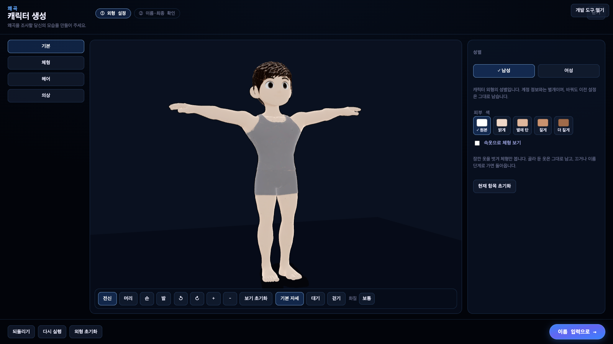
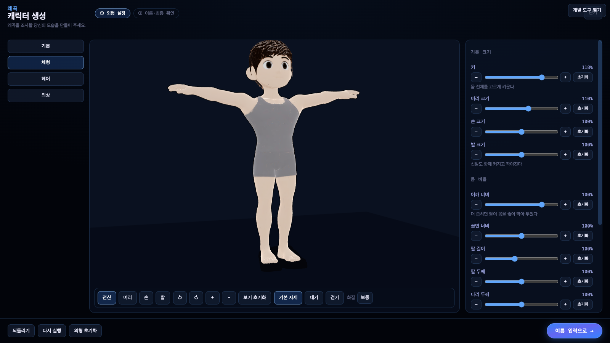
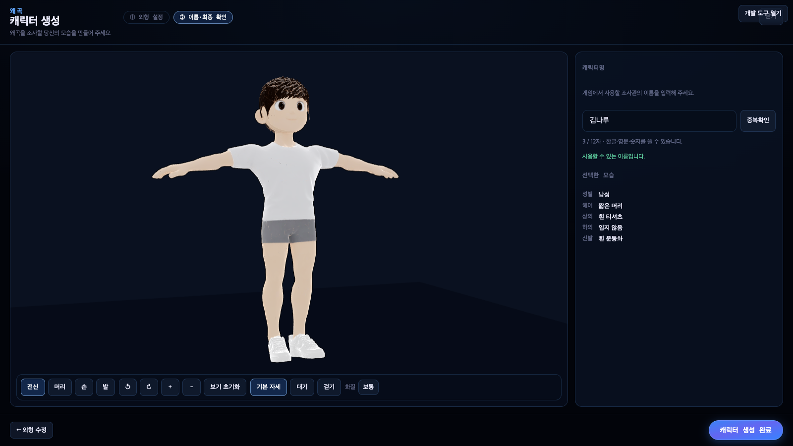

# 캐릭터 생성 화면 인수인계

「왜곡」의 캐릭터 생성 화면이다. **외형 설정 → 캐릭터명 입력·확인 → 완료 데이터 전달**까지가 이 화면의 몫이고,
회원가입·라우팅·인증·실제 저장·오프닝·튜토리얼은 이 화면 밖이다. 서버와는 **부모가 넘겨준 함수**로만 이야기한다.

---

## 1. 실행 방법

```bash
npx vite naju01                      # 개발 서버 (포트 5174 고정)
# → http://localhost:5174/캐릭터생성.html      개발 미리보기(가짜 서버 도구 포함)

node naju01/도구/캐릭터생성검사.mjs   # 자동 검사 25개 (개발 서버가 떠 있어야 한다)
node naju01/도구/캐릭터생성썸네일.mjs # 카드 썸네일 다시 굽기 (에셋이 바뀐 뒤에만)
```

미리보기 오른쪽의 노란 판은 **가짜 서버 조종 도구**다. 실제 화면에는 없다. 여기서 이름 확인 결과
(사용 가능 / 중복 / 허용 안 됨 / 통신 실패 / 느린 응답)와 완료 결과(성공 / 이름 충돌 / 저장 실패 / 예외)를 골라
모든 상태를 재현할 수 있고, `onComplete` 로 나간 데이터와 `onDraftChange` 로 받은 초안을 그대로 볼 수 있다.

---

## 2. 컴포넌트와 파일

| 파일 | 역할 |
|---|---|
| `naju01/src/캐릭터생성/캐릭터생성화면.jsx` | **전달물 본체.** 부모가 가져다 쓰는 컴포넌트(`CC캐릭터생성화면`) |
| `naju01/src/캐릭터생성/캐릭터프리뷰.jsx` | 3D 미리보기 어댑터 — 관찰용 카메라, 부위 보기, 모델 교체 대기 |
| `naju01/src/캐릭터생성/외형데이터.js` | 초안 모양·기본값·보정, **렌더러 키 대응표**, 완료 payload 만들기 |
| `naju01/src/캐릭터생성/카탈로그.js` | 헤어·의상·색 목록(안정 ID ↔ 렌더러 파츠 번호), 썸네일 경로 |
| `naju01/src/캐릭터생성/이름규칙.js` | 이름 정규화·글자 수·형식 검사 |
| `naju01/src/캐릭터생성/스타일.js` | 색·글꼴·공통 스타일(시작페이지 토큰과 같은 값) |
| `naju01/src/캐릭터생성/미리보기.jsx` + `naju01/캐릭터생성.html` | 개발 미리보기 진입점 |
| `naju01/도구/캐릭터생성검사.mjs` | 자동 검사 |
| `naju01/도구/캐릭터생성썸네일.mjs` | 카드 썸네일 굽기 → `public/thumbs/캐릭터생성/` |

**공용 렌더러에 손댄 곳 (최소 변경, 기존 동작 유지)**

| 파일 | 변경 | 왜 |
|---|---|---|
| `naju01/src/치비게임아바타.jsx` | 신발을 신었을 때 발 크기를 **발뼈 배율**로 반영(그때 발 모프는 0) | 신발 GLB 8개에 모프 타깃이 없어, 신으면 발 크기 조절이 안 보였다 |
| `naju01/src/치비게임아바타.jsx` | 파츠의 뼈가 몸 골격에 없으면 **붙이지 않고 `준비.파츠오류` 에 남긴다** | 예전에는 없는 뼈를 0번(뿌리)으로 몰아 붙여, 망가진 채로 그럭저럭 보였다 |

두 변경 모두 지금 에셋에서는 기존과 같은 결과를 낸다(신발 뼈는 전부 대응되고, 발 크기 기본값은 1.0).

---

## 3. 실제로 지원하는 외형

**성별** 남성(`masculine`) · 여성(`feminine`). 캐릭터 외형의 성별이며 계정 정보와 무관하다.
성별마다 초안을 따로 들고 있어 남→여→남 으로 돌아오면 이전 설정이 그대로 복원된다.

**처음 들어왔을 때** 기본 속옷 · 맨발 · 그 성별의 기본 헤어. 초안을 불러온 경우에는 덮어쓰지 않는다.

| 슬롯 | 실제 선택지 | 비고 |
|---|---|---|
| 헤어 | 민머리 / 짧은 머리 · 긴 머리(남) / 단발 · 긴 머리(여) | 성별마다 다르다 |
| 상의 | 입지 않음(기본 속옷) / 흰 티셔츠 | 성별 공용 |
| 하의 | 입지 않음(기본 속옷) / 검은 반바지 | 성별 공용 |
| 신발 | 맨발 / 흰 운동화 | 착장·성별 조합마다 다른 GLB 를 쓴다 |

의상은 파츠를 얹는 방식이 아니라 **그 옷을 입은 전신 GLB 를 통째로 바꿔 끼우는** 방식이다
(`meshy-{base|top|bottom|both}-{male|female}.glb`). 카탈로그에 줄을 더하면 UI 는 자동으로 늘어나지만,
**새 옷의 모델·리깅·체형 대응은 자동으로 따라오지 않는다.** 지원하지 않는 조합은 카탈로그에서 빼야 한다.

**색** 피부 · 머리카락 · 의상 세 갈래. 색은 원본 텍스처에 **곱해진다** — 흰색이 "원본 그대로"이고,
곱셈이라 원본보다 밝게는 못 만든다. 피부의 흰색은 흰 피부가 아니라 원본이라는 뜻이다.
**상의와 하의는 정점 표식이 같아 한 색을 함께 쓴다.** 따로 칠하는 UI 는 두지 않았다.

**체형** (모두 실제 3D 에 반영된다)

| 항목 | 키 | 범위 | 기본 | 어떻게 바뀌나 |
|---|---|---|---|---|
| 키 | `heightScale` | 0.70~1.30 | 1.00 | 캐릭터 전체 균일 배율 |
| 머리 크기 | `headScale` | 0.80~1.30 | 1.00 | head 뼈 배율 |
| 손 크기 | `handScale` | 0.70~1.30 | 1.00 | 모프 |
| 발 크기 | `footScale` | 0.70~1.30 | 1.00 | 맨발은 모프, **신발을 신으면 발뼈 배율**(신발째 커진다) |
| 어깨 너비 | `shoulderWidth` | **1.00~1.25** | 1.20 | 위팔 뼈 위치(아래 5장 참고 — 렌더러 범위보다 좁게 잡았다) |
| 골반 너비 | `hipWidth` | 0.70~1.30 | 1.00 | 모프 |
| 팔 길이 | `armLength` | 0.70~1.15 | 0.88 | 아래팔·손 뼈 위치 |
| 팔 두께 | `armThickness` | 0.70~1.30 | 1.00 | 모프 |
| 다리 두께 | `legThickness` | 0.70~1.30 | 1.00 | 모프 |
| 체형 | `build` | -1~+1 | 0 | 음수 → `skinny`, 양수 → `heavy` (반대쪽은 0) |
| 골격 | `buff` | 0~1 | 0 | 몸통·다리 전체 두께 |

숫자는 cm 가 아니라 **기본 대비 비율**로 보여 준다(모델의 실제 치수를 잰 적이 없다).
어깨 100% = 1.20, 팔 길이 100% = 0.88 이다 — 초기화는 이 보정된 기본값으로 돌아간다.

눈·코·입, 손가락 길이 같은 **지원하지 않는 조절은 넣지 않았다.**

---

## 4. props 와 콜백

```jsx
import CC캐릭터생성화면 from "…/naju01/src/캐릭터생성/캐릭터생성화면.jsx";

<CC캐릭터생성화면
  initialValue={복구할초안}          // 없으면 신규 기본값(속옷·맨발)
  catalog={목록}                    // 없으면 저장소의 실제 에셋 목록
  nameRules={{ 최소: 2, 최대: 12, 허용: "…", 허용설명: "…" }}
  checkName={async (이름, { signal }) => { /* 서버에 묻는다 */ }}
  onDraftChange={(draft) => 임시저장(draft)}
  onComplete={async (payload) => { /* 저장하고 결과를 돌려준다 */ }}
  onCancel={() => 뒤로()}
/>
```

| 입력 | 역할 | 화면의 책임 |
|---|---|---|
| `initialValue?` | 초기 외형·이름 | **마운트할 때 한 번만** 읽는다. 값이 이상하면 기본값으로 보정하고 짧게 안내한다 |
| `catalog?` | 선택지 목록 | 그 성별에 호환되는 것만 보여 준다 |
| `nameRules?` | 이름 형식 규칙 | 안내 문구와 로컬 형식 검사에 쓴다 |
| `checkName(name, { signal })` | 이름 확인 | 확인 중·가능·중복·허용 안 됨·실패를 화면에 비춘다. **없으면 완료를 막는다** |
| `onDraftChange?(draft)` | 초안 알림 | 바뀔 때마다 부른다. 실제 저장은 부모 몫 |
| `onComplete(payload)` | 완료 요청 | 진행 표시·중복 클릭 방지·재시도 안내 |
| `onCancel?()` | 닫기 요청 | 부르기만 한다. 어디로 갈지는 부모가 정한다 |

**주고받는 형식**

```text
checkName 결과
  { status: 'available' }
  { status: 'taken'  | 'invalid', message?: string }
  통신 실패 → Promise 거절 (화면은 '확인 실패' 로 표시)

onComplete 결과
  { ok: true }
  { ok: false, reason: 'name_taken' | 'invalid' | 'failed', message?: string }
  예외 → Promise 거절 (화면은 재시도 안내)

onComplete 로 나가는 payload (순수 데이터만 — three 객체·함수·모델 없음)
  {
    schemaVersion: 1,
    displayName: "김나루",
    appearance: {
      catalogVersion: "2026-09-24",
      bodyAssetVersion: "20",
      gender: "masculine",
      bodyParameters: { heightScale, headScale, shoulderWidth, hipWidth,
                        armLength, armThickness, legThickness,
                        handScale, footScale, build, buff },
      hairId: "hair.m.crop",
      equipmentIds: { top: "top.tee.white", bottom: "bottom.none", shoes: "shoes.sneaker.white" },
      supportedColorValues: { skin: "#ffffff", hair: "#ffffff", cloth: "#ffffff" }
    }
  }
```

`onDraftChange` 로 나가는 초안은 `{ schemaVersion, displayName, appearance }` 이며, `appearance` 는 위에서
`catalogVersion`·`bodyAssetVersion` 만 뺀 모양이다. 그대로 `initialValue` 에 넣으면 복원된다.

**주의**

- `checkName` 의 '사용 가능' 은 **예약이 아니다.** 최종 제출에서 서버가 `name_taken` 을 돌려줄 수 있고,
  그때 화면은 외형을 유지한 채 이름 확인만 무효로 돌린다.
- `initialValue` 는 마운트할 때만 읽는다. **다른 캐릭터로 바꾸려면 부모가 `key` 를 바꿔 다시 마운트**해야 한다.
- 완료가 성공해도 이 화면은 스스로 다음 화면으로 넘어가지 않는다. 부모가 화면을 교체할 때까지 완료 상태를 유지하고
  다시 누를 수 없게 막는다.
- 계정 ID·토큰·오프닝 시청 여부·튜토리얼 진행은 이 화면이 다루지 않는다. localStorage 에 계정 데이터를 쓰지 않는다.

**외형을 실제 캐릭터에 입히는 법** — `외형데이터.js` 의 `렌더러설정(외형, 카탈로그)` 가 payload 의 `appearance` 를
`치비게임아바타` 의 `설정` 으로 바꿔 준다. 게임 화면에 적용하는 작업은 이 함수를 그대로 쓰면 된다.
아이템 ID → 파츠 번호 대응은 `카탈로그.js` 한 곳에만 있다.

---

## 5. 검증 결과

`node naju01/도구/캐릭터생성검사.mjs` — **25개 전부 통과** (macOS, Chrome, 1600×950).

확인한 것: 신규 기본이 속옷·맨발인지 / 기본값이 보정된 값(어깨 1.20·팔 0.88)인지 / 키 슬라이더가 실제 모델 높이를
바꾸는지(1.51 m → 1.96 m / 1.06 m) / 항목 초기화 / 성별별 초안 보존(남 1.25 · 여 0.85) / 옷을 갈아입어도 체형 유지 /
**신발을 신은 채 발 크기가 신발에 반영되는지**(0.24 → 0.44) / 옷을 연달아 빨리 눌러도 화면이 마지막 선택과 맞는지 /
확인 도중 이름을 바꾸면 늦게 온 답이 '사용 가능' 으로 남지 않는지 / 중복·형식 오류 / 완료 데이터의 내용 /
완료가 저절로 화면을 넘기지 않는지 / 완료 뒤 다시 못 누르는지 / 초안을 `initialValue` 로 넣으면 복원되고
**이름은 다시 확인해야 하는지** / 키보드로 슬라이더 조작(Home·End·방향키) / 모든 슬라이더에 라벨이 있는지 / 페이지 오류 없음.

눈으로 확인한 것: 1280×720·1600×900·1920×1080 레이아웃(캐릭터·조절 항목·진행 단추가 겹치지 않는다),
남녀 × 속옷/상의/하의/전체 착장 × 신발 유무, 체형 기본·최소·최대·극단 조합(정면·측면·45°),
헤어 3종, 색 팔레트, 한글 입력 조합 중 오작동 없음.

성능: MacBook(Chrome, 1920×1080) 에서 화질 낮음·보통·높음 모두 **90 fps**(화면 주사율 상한).
탭이 안 보이면 렌더링을 멈춘다. 처음 진입에 필요한 모델만 읽고, 옷을 바꿀 때는 새 모델을 다 읽은 뒤에 갈아 끼운다.

### 남은 제약 (에셋 쪽 숙제)

1. **어깨 너비 하한을 1.00 으로 막아 두었다.** 렌더러는 0.75 까지 받지만, 0.75 로 좁히면 걸을 때 손가락이
   반바지 안으로 들어가고 남성 팔짱 대기에서 아래팔이 가슴에 파묻힌다(눈으로 확인). 1.00 은 둘 다 깨끗했다.
   더 좁은 어깨를 지원하려면 팔짱 클립 보정과 걷기 팔 궤적을 어깨 폭에 맞춰 바꿔야 한다.
2. **신발에는 모프 타깃이 없다.** 지금은 발뼈 배율로 신발째 키우고 줄인다. 발 크기를 크게 키우면 발목에서
   신발과 종아리가 만나는 선이 조금 두꺼워 보인다. 신발 GLB 에 손·발 모프를 함께 구우면 깔끔해진다.
3. **상·하의 색이 하나로 묶여 있다.** 정점 표식(`_TINT`)이 의상을 한 갈래로만 구분한다. 따로 칠하려면
   표식을 상·하의로 나눠 다시 구워야 한다(`naju01/도구/meshy_mark_tint.py`).
4. **썸네일은 구운 그림이다.** 에셋을 다시 구우면 `naju01/도구/캐릭터생성썸네일.mjs` 로 다시 만들어야 한다.
5. 색은 곱셈이라 **원본보다 밝은 피부·머리색은 만들 수 없다.**

---

## 6. 화면

| | |
|---|---|
|  |  |
|  |  |
